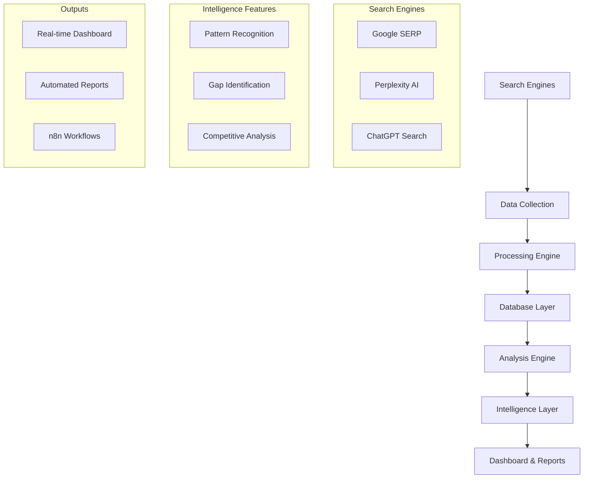

# 🔍 AI Search Intelligence System

> **Comprehensive AI search intelligence platform for tracking, analyzing, and optimizing content performance across multiple AI-powered search engines**

[](https://www.python.org/downloads/)
[](https://fastapi.tiangolo.com/)
[](https://opensource.org/licenses/MIT)

## 🚀 What This System Does

Transform AI search visibility from reactive guesswork into **proactive, data-driven content intelligence** with:

- **🎯 Multi-Engine Citation Tracking**: Google AI Overviews, Perplexity, ChatGPT Search, and more
- **🧠 AI-Powered Gap Analysis**: Automatically identify high-value content opportunities
- **📊 Real-Time Analytics**: Interactive dashboard with citation trends and performance metrics
- **🤖 Automated Intelligence**: Daily collection, weekly reports, and instant opportunity alerts
- **⚔️ Competitive Analysis**: Track competitor strategies and market position
- **📈 Predictive Insights**: ML-powered pattern recognition for strategic planning

## 🏗️ System Architecture



## 📊 Key Features

### 🔍 **Multi-Engine Citation Tracking**
- **Google SERP**: AI Overviews, Featured Snippets, People Also Ask, Knowledge Panels
- **Perplexity AI**: Direct answer citations, source attribution, follow-up questions
- **Extensible**: Ready for ChatGPT Search, Claude, Bing Copilot integration

### 🧠 **Advanced Intelligence Engine**
- **ML Pattern Recognition**: Identify citation patterns across engines and content types
- **Content Gap Analysis**: Score opportunities from 0.0-1.0 with reasoning
- **Competitive Intelligence**: Track competitor citation strategies and market share
- **Content Performance**: Deep analysis of what gets cited and why

### 📊 **Real-Time Analytics Dashboard**
- **Interactive Charts**: Citation trends, domain performance, engine comparisons
- **Live Metrics**: Total citations, growth rates, opportunity scores
- **Content Intelligence**: Gap identification with actionable recommendations
- **Executive Reports**: Comprehensive insights for strategic planning

### 🤖 **Complete Automation Suite**
- **Daily Collection**: Automated citation gathering across all engines
- **Weekly Reports**: Comprehensive intelligence reports with insights
- **Opportunity Alerts**: Real-time notifications for high-value content gaps
- **Competitive Monitoring**: Track competitor performance automatically

## 🎯 Use Cases

### **Content Teams**
- Identify high-opportunity content gaps with precise scoring
- Understand what content types perform best in AI search
- Track content performance across multiple AI engines
- Get automated recommendations for content creation

### **SEO Professionals**
- Monitor AI search visibility beyond traditional SERP tracking
- Analyze citation patterns to optimize for AI Overviews
- Track competitor strategies in AI-powered search
- Measure ROI of AI search optimization efforts

### **Marketing Leaders**
- Get executive dashboards with strategic insights
- Understand market position in AI search landscape
- Receive automated weekly intelligence reports
- Track brand mention and citation trends

### **Product Managers**
- Identify content opportunities for product positioning
- Monitor how product features get cited in AI responses
- Track competitive landscape in AI search results
- Plan content roadmaps based on gap analysis

## 🚀 Quick Start

### 1. **Prerequisites**
```bash
# Required
Python 3.11+
PostgreSQL 13+
Redis 6+

# Optional (recommended)
InfluxDB 2.0+ (time-series data)
n8n (workflow automation)
```

### 2. **Installation**
```bash
git clone https://github.com/gabeomat/ai-search-intelligence.git
cd ai-search-intelligence
python -m venv venv
source venv/bin/activate  # or venv\Scripts\activate on Windows
pip install -r requirements.txt
```

### 3. **Configuration**
```bash
cp .env.example .env
# Edit .env with your API keys and database credentials
```

### 4. **Launch System**
```bash
# Start API server
python -m ai_search_intelligence.api.main

# Access dashboard: http://localhost:8000/dashboard
# API docs: http://localhost:8000/docs
```

## 📖 Documentation

- **[📋 Setup Guide](SETUP.md)**: Complete deployment instructions
- **[🏗️ Architecture](ARCHITECTURE.md)**: System design and technical details
- **[🤖 n8n Workflows](n8n-workflows/README.md)**: Automation setup and configuration

## 🔧 Core Components

### **Citation Collection Engine**
```python
from ai_search_intelligence.engines.google_serp import GoogleSERPCollector
from ai_search_intelligence.engines.perplexity import PerplexityCollector

# Collect citations from multiple engines
google = GoogleSERPCollector()
citations = await google.collect_citations("AI search optimization")
```

### **Gap Analysis Engine**
```python
from ai_search_intelligence.analysis.gap_identification import ContentGapAnalyzer

analyzer = ContentGapAnalyzer()
gaps = await analyzer.identify_content_gaps(
    citations=citations,
    tracked_queries=queries,
    competitor_domains=["competitor.com"]
)
```

### **Pattern Recognition**
```python
from ai_search_intelligence.analysis.pattern_recognition import CitationPatternAnalyzer

pattern_analyzer = CitationPatternAnalyzer()
patterns = pattern_analyzer.analyze_citation_patterns(citations)
insights = pattern_analyzer.generate_pattern_insights(patterns)
```

## 📊 Analytics Dashboard

The system includes a comprehensive web dashboard featuring:

- **📈 Citation Trends**: Track performance over time across all engines
- **🏆 Top Domains**: See which domains dominate citations in your space
- **🔍 Engine Analysis**: Compare performance across Google, Perplexity, etc.
- **🎯 Content Opportunities**: Scored gap analysis with actionable recommendations
- **⚔️ Competitive Intelligence**: Monitor competitor citation strategies

Access at: `http://localhost:8000/dashboard`

## 🤖 Automation Workflows

Pre-built n8n workflows for complete automation:

### **Daily Citation Collection**
- Automated data gathering from all configured engines
- Rate limiting and error handling
- Slack/email alerts on failures
- Performance metrics logging

### **Weekly Intelligence Reports**
- Comprehensive analysis of citation performance
- Content opportunity identification
- Competitive intelligence updates  
- Automated email distribution

### **Real-Time Opportunity Alerts**
- High-priority content gap notifications
- Automatic action item creation
- Team notifications via Slack/email
- Opportunity scoring and prioritization

## 🎯 Advanced Features

### **Machine Learning Analytics**
- **Citation Pattern Recognition**: Identify what content gets cited
- **Trend Prediction**: Forecast citation opportunities
- **Content Scoring**: ML-powered opportunity assessment
- **Competitive Analysis**: Automated competitor strategy detection

### **Enterprise Reporting**
- **Executive Dashboards**: Strategic insights for leadership
- **Custom Reports**: Weekly, monthly, quarterly intelligence
- **Export Options**: HTML, PDF, JSON formats
- **Automated Distribution**: Email, Slack, webhook delivery

### **Competitive Intelligence**
- **Market Share Analysis**: Track citation share across competitors
- **Strategy Detection**: Identify competitor content patterns
- **Threat Assessment**: Monitor competitive moves
- **Opportunity Identification**: Find gaps in competitor coverage

## 📈 Results You Can Expect

### **Immediate Value (Week 1)**
- Complete visibility into AI search citation performance
- Identification of 10-20+ high-value content opportunities
- Baseline competitive intelligence across your market
- Automated data collection replacing manual monitoring

### **Short-term Impact (Month 1)**
- 15-30% increase in AI search citations through gap targeting
- Clear content strategy informed by citation patterns
- Competitive advantage through superior intelligence
- Streamlined content planning with opportunity scoring

### **Long-term Growth (Quarter 1)**
- Market leadership position in AI search visibility
- Predictive content planning based on trend analysis
- Comprehensive competitive moats through content intelligence
- ROI-driven content strategy with measurable outcomes

## 🔮 Roadmap

### **Phase 2 (Next Quarter)**
- **Additional Engines**: ChatGPT Search, Claude web search, Bing Copilot
- **Advanced ML**: Predictive modeling for citation trends
- **Content Automation**: Auto-generate content briefs from gaps
- **API Integrations**: CMS, marketing tools, analytics platforms

### **Phase 3 (Future)**
- **Multi-tenant Support**: Agency and enterprise deployment
- **Advanced Permissions**: Team-based access and workflows
- **Custom Models**: Industry-specific citation analysis
- **Global Expansion**: Multi-language and regional analysis

## 🤝 Contributing

We welcome contributions! Please see our contributing guidelines and:

1. Fork the repository
2. Create a feature branch (`git checkout -b feature/amazing-feature`)
3. Commit your changes (`git commit -m 'Add amazing feature'`)
4. Push to the branch (`git push origin feature/amazing-feature`)
5. Open a Pull Request

## 📄 License

This project is licensed under the MIT License - see the [LICENSE](LICENSE) file for details.

## 🙋‍♂️ Support

- **Issues**: [GitHub Issues](https://github.com/gabeomat/ai-search-intelligence/issues)
- **Discussions**: [GitHub Discussions](https://github.com/gabeomat/ai-search-intelligence/discussions)
- **Documentation**: [Setup Guide](SETUP.md) | [Architecture](ARCHITECTURE.md)

---

**🚀 Ready to dominate AI search? Deploy your intelligence system today!**

⭐ **Star this repo** if you find it valuable for your AI search optimization efforts!